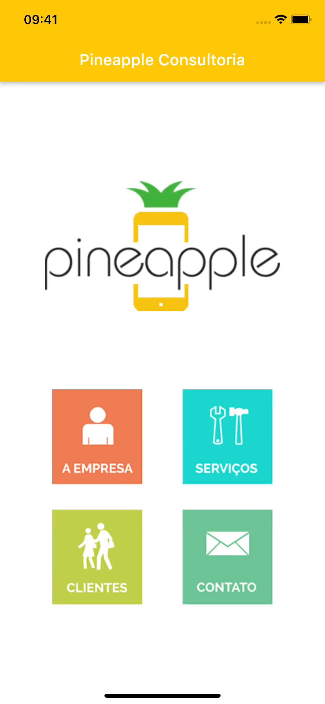

# Pineapple Consultoria
> App de uma empresa fictícia utilizando o framework Flutter.

Projeto para estudo do framework Flutter e da linguagem Dart.

Possui quatro telas navegáveis que são acessadas a partir da tela principal. Cada uma das telas possui conteúdos distintos sobre a empresa fictícia.

Conteúdo estudado e implementado neste App: base scaffold, componentes de interface, stateful widget, gesture detector e navegação entre telas.
## Screen Recording Android:

## Screen Recording iOS:

## Histórico de Atualizações:  

* 20221108:
    * Versão inicial.

## Links:

[https://github.com/danielperesjr/pineapple-consult-flutter](https://github.com/danielperesjr/pineapple-consult-flutter)